北邮信通导论课进阶实验 - Node JS + Mongodb + 微信小程序开发者接口
===

# 后端的必要性

在[云函数](https://www.oursparkspace.cn/?yada_wiki=1541583107)我们大致了解了业务逻辑的处理并不在手机上进行，所以采用了方便快捷的云函数。但是并不是所有的功能都能够通过云函数实现，所以往往在大多是的生产中，都采用自己搭建服务器作为整个服务的后端。

而且各位应该都已经注册了自己人生中第一个域名以及租赁了人生中第一台服务器，怎么能放着不用呢？通过自己的努力，让他们变得实用起来吧！

没有购买域名或者域名由于没有通过实名认证并不能使用的可以在Freenom注册免费域名（不能备案）进行尝试，没有购买服务器请参考之前的教程租赁学生服务器。

# 目标速览

初始化： 在远程的mongodb上插入一条数据
<!-- TODO: 插入图片 mongo-express 后台图片 -->

有一个表单，里面有一个输入框组件用来输入内容，点击提交按钮以修改云数据库里content字段。还有一个显示区域用于从云数据库读取上面的记录，点击读取按钮成功读取记录后把content字段的值显示在下面。


在输入框里输入新的字符串


点击提交，更新记录成功后清空输入框。再点击读取按钮，把该记录的content字段的值显示在下面。


<!-- PS: TODO: 上面的图片需要更换 -->

# 总体框架


整体请求流程大概是这样的：

1. 用户点击按钮出发事件 @显示层
2. js文件调用wx.request @数据逻辑层
3. 微信小程序底层开始建立TCP连接，发送HTTP报文 @微信小程序底层
4. 后台Nginx(是一个高性能的HTTP和反向代理服务)解析HTTP请求并转发给Nodejs处理 @Nginx
5. Nodejs处理请求，向MongoDB发出对应的操作指令 @NodeJS
6. MongoDB处理请求并返回数据 @MongoDB
7. Nodejs收到请求返回给Nginx @Nodejs
8. Nginx收到Nodejs回复，发送HTTP回应给请求者 @Nginx
9. 微信小程序底层收到TCP数据并解析HTTP返回数据返回给对应的回调函数 @微信小程序底层
10. 微信小程序js文件的回调函数被调用，更新数据等 @数据逻辑层
11. 界面刷新或者产生提示信息 @显示层

# 搭建服务器的主要功能点

- Nginx： 配置服务器的Nginx 使其能够正确的处理请求
- Nodejs： 能够上传代码到远程服务器并使其能够正确运行
- Mongodb： 在远程运行数据库并顺便使之可以使用简单的web管理界面进行管理

主要难点：

- 远程访问服务器使用命令行，学习如何使用帮助来使用这些命令。
- 修改各种文件中的配置，使之符合客观事实。

# 服务器搭建

目标： 使得自己的服务器能够正常工作

## step1.连接自己的服务器

### 下载客户端

这里推荐使用[MobaXterm](https://mobaxterm.mobatek.net/)虽然是英文界面，但是可以使用sftp进行文件管理，免去了上传文件的痛苦。

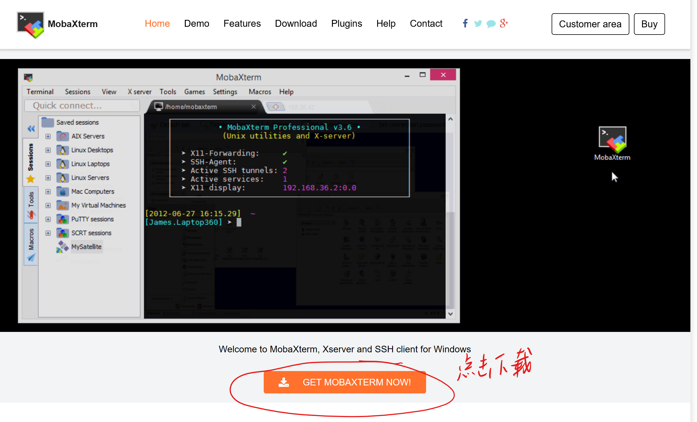


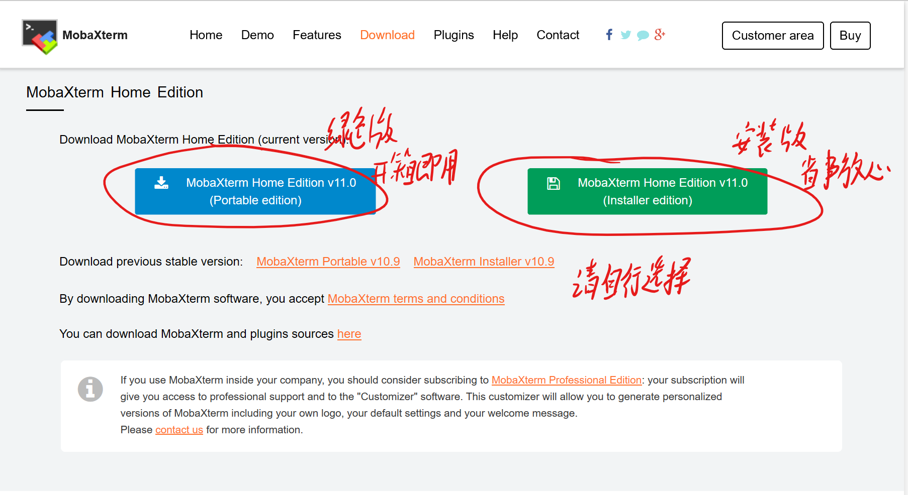

### 安装

#### 绿色版:


#### 安装版

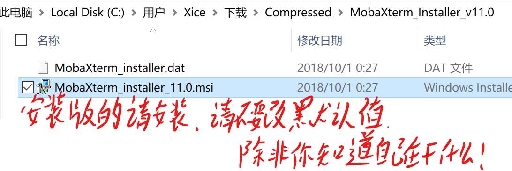


### 运行

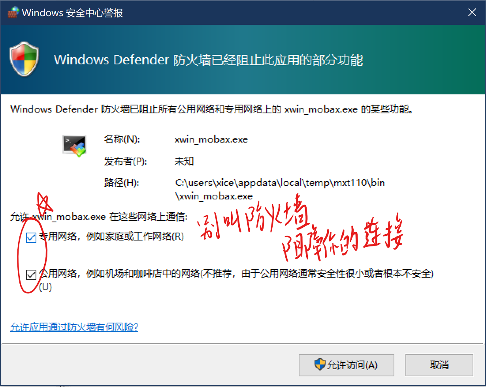

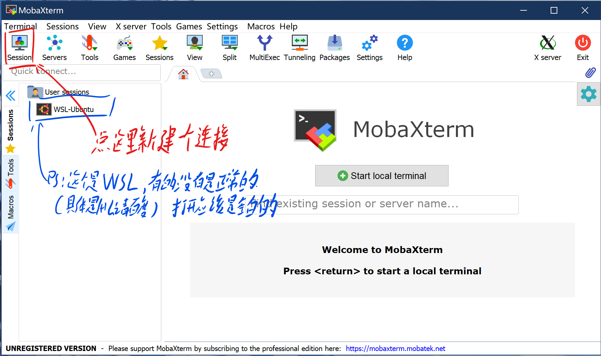

**下面的教程面向Ubuntu/Debian系统** 如果不是请去腾讯云进行重装

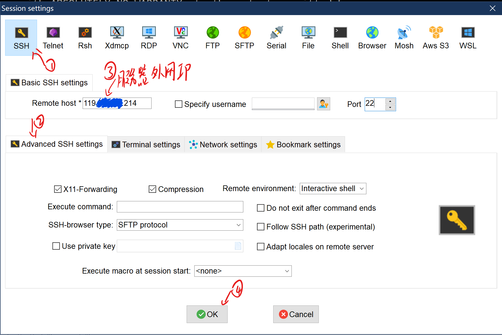

这个软件非常强大，自己可以摸索（百度）一下如何使用。

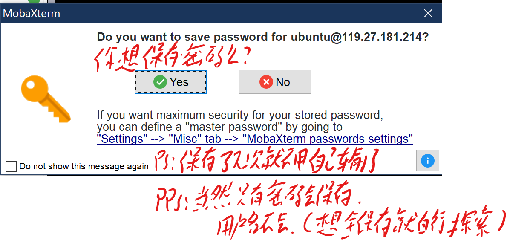

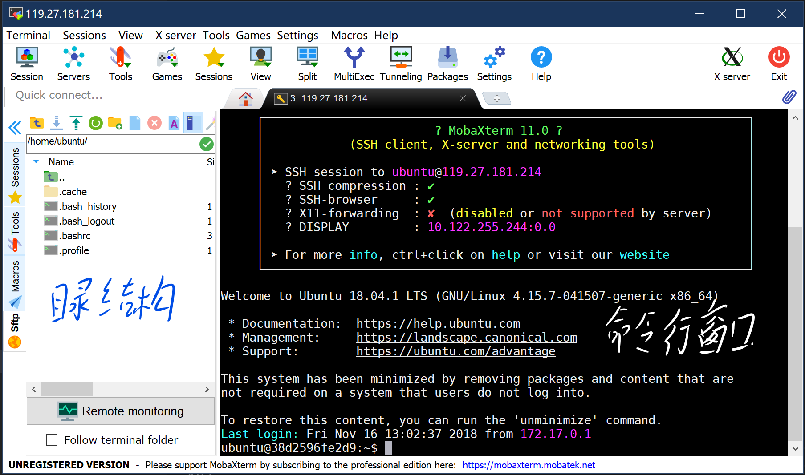

之后我们就可以愉快的进行系统配置了！

## step2.安装所有的软件

既然是命令行，那么所有的操作都可以通过命令行完成。

更新软件库

```bash
$ sudo apt update
```

> tip: 通常教程或者书本在写命令的时候都会在命令起那面添加一个$或者#。$代表是以普通的用户身份运行，#代表使用管理员权限运行。后面的内容才是命令本身，如果粘贴的时候带上$会报错呦。

安装一波软件

```bash
$ sudo apt install vim git curl wget htop unzip tree nginx mongodb nodejs npm -y
```

然后就是漫长的安装过程，这个时候我们可以研究一下这都是什么东西。

- vim ： 大名鼎鼎的文本编辑器，什么你没听说过，那就是因为他生活在命令行次元，和可视化的不是一个次元，到底有多又名呢？可以去百度一下。你可以用它在服务器上临时编辑一些文本，方便的很。
- git ： 非常好用的，全世界通用的代码管理软件，相信你不会不知道吧。
- curl ： 用来发送http请求的工具，用它来调试网络api再好不过了。
- wget ： 基本上同上，但是倾向于把文件下载下来。
- unzip : 用来解压文件的工具
- htop ： linux的任务管理器，可以看看现在有什么程序正在运行。
- nginx ： 我们的主角nginx服务
- mongodb ： 我们亲爱的数据库
- nodejs ：不用再介绍了吧
- npm : 非常好用的包管理器，配合node食用味道更加

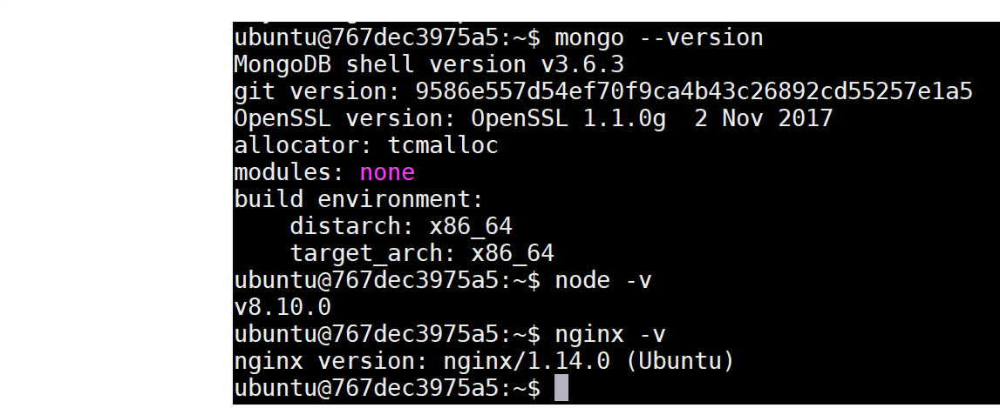

## step3.上传代码

**！！打开service/config/index.js，填写自己的微信小程序appid和secretKey。！！**

**WARRING** Linux可脾气没有Windows好，文件别瞎放了，小心Linux....


> 在参加芬兰的阿尔托大学举办的活动时，Linus Torvalds与同学们进行了互动。当一个学生问道，怎么样能让Linux运行在自己的采用NVIDIA显卡的Optimus笔记本上，Torvalds发飙了，直接转向摄像头，竖起中指，破口大骂：“NVIDIA，Fuck You”。当时大家就震惊了。

一笑而过，建议各位在操作什么路径的时候，先了解一下这个路径的意义，再瞎搞可就真的凉了。

> - /bin 二进制可执行命令
> - /dev 设备特殊文件
> - /etc 系统管理和配置文件
> - /etc/rc.d 启动的配置文件和脚本
> - /home 用户主目录的基点，比如用户user的主目录就是/home/user，可以用~user表示
> - /lib 标准程序设计库，又叫动态链接共享库，作用类似windows里的.dll文件
> - /sbin 系统管理命令，这里存放的是系统管理员使用的管理程序
> - /tmp 公用的临时文件存储点
> - /root 系统管理员的主目录（呵呵，特权阶级）
> - /mnt 系统提供这个目录是让用户临时挂载其他的文件系统。
> - /lost+found 这个目录平时是空的，系统非正常关机而留下“无家可归”的文件（windows下叫什么.chk）就在这里
> - /proc 虚拟的目录，是系统内存的映射。可直接访问这个目录来获取系统信息。
> - /var 某些大文件的溢出区，比方说各种服务的日志文件
> - /usr 最庞大的目录，要用到的应用程序和文件几乎都在这个目录。其中包含：
> - /usr/X11R6 存放X window的目录
> - /usr/bin 众多的应用程序
> - /usr/sbin 超级用户的一些管理程序
> - /usr/doc linux文档
> - /usr/include linux下开发和编译应用程序所需要的头文件
> - /usr/lib 常用的动态链接库和软件包的配置文件
> - /usr/man 帮助文档
> - /usr/src 源代码，linux内核的源代码就放在/usr/src/linux里
> - /usr/local/bin 本地增加的命令
> - /usr/local/lib 本地增加的库

虽然看着多，到时候用到了再来查。

Q: 不知道自己在什么路径怎么办呢？

A: 一般有两种办法

1. bash这个shell里的命令提示符中可以知道

```
ubuntu@767dec3975a5:~$
```

这就是一个bash的命令提示符，用来提醒你可以输入新的命令。它由几部分组成。`用户名@主机名:当前路径$`。`~`是一个环境变量HOME的缩写，一般用户的HOME都指向`/home/用户名`。

关于www的路径就是`/var/www`。熟练的使用`cd`和`ls`（类似于windows的`dir`）命令可以让你知道“我是谁”，“我在哪”，“我在干什么”的哲学三问。

2. 使用 `pwd` 命令，直接返回你当前所在的绝对路径。

tip:

- `cd`:后面直接跟路径就是了，linux下面没有盘符的概念，所以想去哪里就直接一个cd过去。

    路径分为绝对路径和相对路径。

    - “绝对路径”： 就是指向位置不随当前位置以及调用环境改变而改变的路径，一般上是`/`开头，从根目录开始一直到所需要的位置的完整路径。
    - “相对路径”： 不同于绝对路径，相对路径是再当前位置或者环境变量的基础上进行索引的。

    在每个路径下面都会两特殊的文件 `.` 和 `..`

    - “.”： 指向当前路径
    - “..”： 指向上级路径
- `ls`: 列出当前目录的文件列表。
    
    常用参数：

    - -l : 略出详细信息，包括大小 所有者 所有用户组 权限设置
    - -a : 列出所有文件，包括上面提到的两个特殊文件。以及隐藏文件

这两个命令可以自己尝试一下，这都是读取的命令，不同担心造成什么损坏，到处转转看看不同的路径里面有什么文件，

了解的差不多我们就可以开始上传代码了。

**PS**：当然上传代码的方式可谓是八仙过海各显神通了。下面简单描述一下几种方式，然后详细介绍一种方式。

1. 利用git： 首先将自己的代码传到远程的git仓库（githua、gitlab等等）然后使用刚才安装的git工具clone下来。
2. 利用网盘： 你可以在自己的服务器上面建一个网盘，然后直接通过网站上传。
3. 利用复制粘贴： 你也可以把所有代码一个一个文件复制过去，当然，这需要一定的耐心。
4. 使用sftp上传（详细）：使用ssh自带的sftp上传文件。

我们详细的来讲讲第4种方式。

当然我想各位应该已经看到了左边这个目录，双击`..`就可以到上一个目录，或者直接在上面的路径框输入想去的路径回车就可以到了（类似于`cd`）。然后直接显示在这里相当于`ls`。

先将需要上传的代码**修改好**，然后打包成一个`.zip`格式的zip压缩包直接拖拽到空白的地方就可以上传了就可以进行上传。

<!-- TODO: 上传文件的图片 -->

当然，作为一个普通用户，做好的存放地点当然是自己的“HOME”

**思考**：为什么需要打包之后再上传呢？为什么不直接拖拽文件夹呢？（好奇的你可以试一试）

然后我们对这个压缩包进行解压。

```bash
$ unzip server.zip
```

请自己替换需要解压的文件文件名，如果觉得自己一个一个字符输入十分费劲，也可以试一试Tab补全。只输入文件名的一部分然后按一下Tab你就会发现文件名自己补全了。当然如果不会自动补全有可能是因为根本不存在这个开头的文件，或者是以这个开头的文件不止一个，后者再按一下tab会在下面列出所有可能的结果，当然不能太多。

<!-- TODO: Tab使用的动图 -->

然后进入到这个文件夹里安装所需要的依赖

```
$ npm i
```

PS: `i` 就是`install`参数的简写，平时也可以用，程序员可是非常懒的，常用的命令字符能少一个是一个。

然后运行

```
$ npm run start
```

为什么这个跟平时使用的`node app.js`不太一样呢？之前你只能说是运行一个脚本，现在你就可以说运行的是一个项目了！使用包管理器来管理你的项目，更加规范。

当然这并不是白来的，这种操作也需要严格的定义，相关配置文件就是`package.json`。想要更深层了解的同学可以百度：“npm run”来了解其工作形式，或者直达：[npm脚本命令npm run script的使用](https://www.cnblogs.com/zhaozhipeng/p/8269403.html)进行学习。

好的看到没有什么 红色的ERR! 就是完成运行了。

## step4.申请HTTPS证书

最为HTTPS加密的最重要的一点就是证书啦，相关的信任链，证书链，非对称加密等可以说是信息安全发展的丰硕成果，虽然你平时不知道，但是他们却在时时刻刻保护你的安全。

证书的类型有很多，我们就申请一个免费的DV证书---[Let’s Encrypt](https://letsencrypt.org/)。

### 配置域名解析

#### freenom用户需要改NameServer

**PS**: 腾讯云域名注册用户跳过这一步！！！

首先打开百度->搜索: 使用dnspod解析freenom

然后找一个靠谱的文章，例如：[使用DNSPod解析Freenom域名 - ssooking - 博客园](https://www.cnblogs.com/ssooking/p/6364639.html)

跟着一步一步走，由于dnspod就是腾讯家的，直接用腾讯云账号直接登陆就好了，然后就可以跟在腾讯云卖域名的小伙伴一起玩耍了。

#### DnsPod解析

打开 [Dnspod官网](https://www.dnspod.cn/)，使用登陆腾讯云的账号登陆。

点击左边的“域名解析”，你就可以看见自己的域名了。

点击你的域名，就可以进入解析管理的页面。

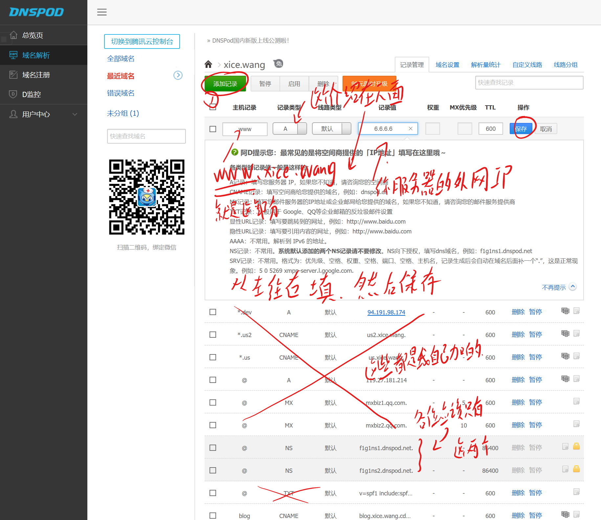

然后你就会发现他在下面产生了。主机记录，比如我用的就是www，那么一会我的域名就是www.xice.wang。如果是cn，那么就是cn.xice.wang，以此类推。

这样子我们的解析就完成了，想测试一下的可以使用`cmd`自带的工具`nslookup`进行尝试。

Win + R 打开运行，输入 cmd ，回车

输入命令：

```cmd
nslookup www.xice.wang
```

就可以看到结果了

#### 获得ID 和 Tocken

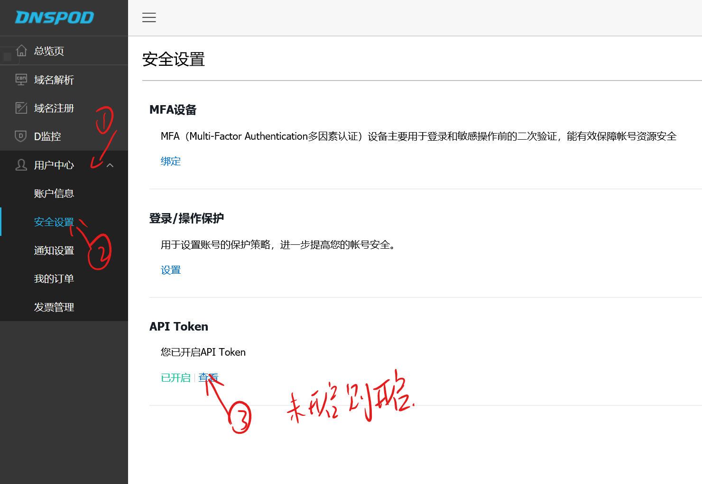

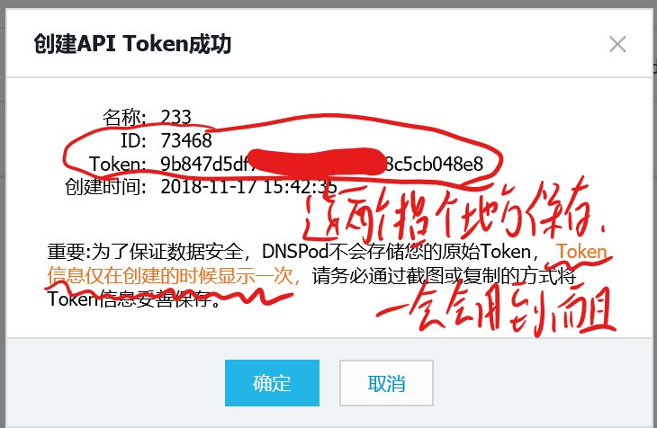

### 安装 acme.sh

切换到root权限

```bash
$ sudo -i
```
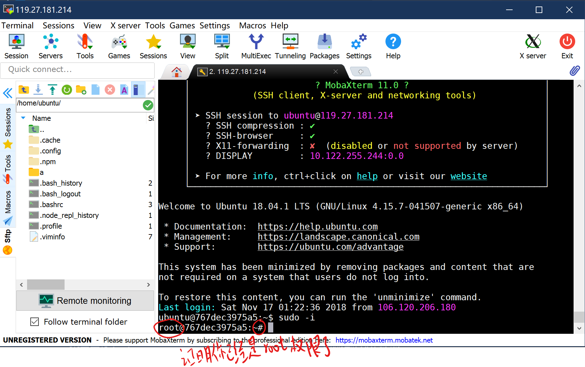

下载签名工具 [acme.sh](https://acme.sh)

**PS**: cron 默认会随系统安装，但是作为acme.sh的重要依赖，还是手动确认一下安装情况，不装的话等提醒再来也来得及

```bash
# apt install cron
# curl  https://get.acme.sh | sh
```

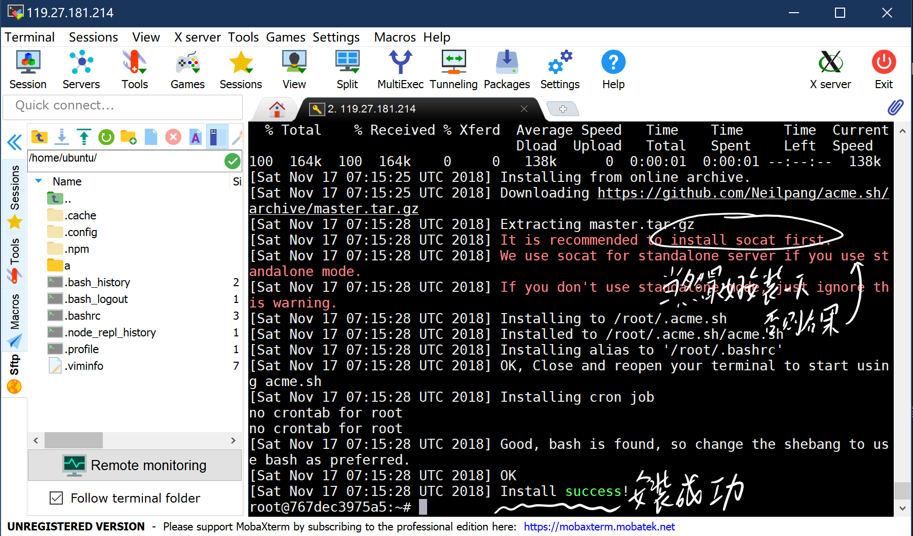

安装socat的方式可能也猜到了，就是

```bash
# apt install socat
```

当然，不装问题也不大，因为我们采用dns_api的申请证书的方式。

将我们上一步得到的ID 和 Tocken 找出来。一会准备用。

```bash
# vim ~/.acme.sh/dnsapi/dns_dp.sh
```

使用vim进行编辑。

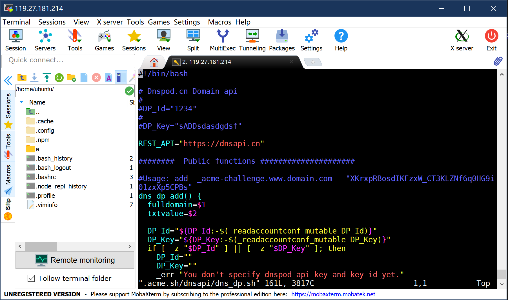

关于vim更高级的使用方式请自行学习。

使用上下左右移动光标，到 #DP_Id="1234" 前面的这个井号上面，使用Del键取消注释（就是删掉这个井号。然后往后移动，删除1234，这一行仅仅留下 DP_Id=""，此时按 i 切换到插入模式（右下角显示一个 \-\- INSERT \-\-）在两个引号之间输入你的ID，按ESC退出插入模式。

然后按照上面的步骤输入Tocken。

Tocken太长了，我不想一个一个输入怎么办？研究一下这个界面，怎么复制粘贴。

全部修改完毕之后我们来推出并保存

输入一个 : (就是一个冒号) 进入命令模式(左下角有一个冒号)

输入 q 回车 (q命令就是 保存并退出的意思。)

别的东西就自己探究一下吧。

回到命令行我们来申请证书

```bash
# ~/.acme.sh/acme.sh --issue -d www.xice.wang --ecc -k ec-384 --dns dns_dp
```

静静等待两分钟，这个工具会帮你完成所有的事情。

然后你就会看见一坨私钥和告诉你这些文件都保存在哪里。

你的证书就得到了！

## step5.配置nginx

使用之前上传代码的方式，上传nginx的配置文件，如果你喜欢使用vim可以传上去之后再改。

把里面 所有的 <你的域名> 替换成 你的域名 （好像废话。。。

例如我就是用 www.xice.wang 替换他们。


**PS**：这张截图我申请证书的域名是 xice.wang， 请随机应变。

我们替换的几个地方包括：nginx 的ServerName和证书路径，还有输出的日志什么的。

确认没问题之后我们就把这个配置文件放在正确的位置上。

```bash
# mv /home/ubuntu/myfunction.conf /etc/nginx/sites-available/
```

我们又学了一个新命令`mv`就是把前面这个文件移动到后面这里，类似于剪切。如果后面是一个目录则会在这个目录下生成同源文件名的文件，如果后面是一个文件，则会直接覆写。使用请慎重。

前面的位置因人而异，你上传在哪里就在那里。

当然我们可以切换到这个nginx的配置文件下面看个究竟：

```bash
# cd /etc/nginx
# ls
conf.d          koi-win            nginx.conf       sites-enabled
fastcgi.conf    mime.types         proxy_params     snippets
fastcgi_params  modules-available  scgi_params      uwsgi_params
koi-utf         modules-enabled    sites-available  win-utf
```

我们还需要把这个配置文件放置在sites-enbaled中才会生效，为了避免复制之后文件更改难以同步，所以我门在`sites-enabled`中创建一个“快捷方式”(符号链接)。为什么不直接放到enable中呢？因为我们有时需要暂时关闭某网站，但是又不想彻底删除这个配置文件，所以采用这种方式就可以只删除符号链接就可以了。

```bash
# ln -s /etc/nginx/sites-available/myfunction.conf sites-enabled/
```

创建符号链接，注意，源文件一定要写绝对路径，除非一些特别情况，具体情况就可以自行探索和理解，结合相对路径和绝对路径的知识。

然后检测一下配置是否存在问题

```bash
# nginx -t
```

应该没有问题，有的话就自己更改吧(:

使用

```bash
# systemctl reload nginx.ervice
```

使得 nginx 重新加载配置文件。

## step6.微信小程序

至此 整个服务端都完成了配置，我们开始折腾微信小程序。

修改 app.js 里面的 urlBase

因为我们已经开启了HTTPS服务，并且配置好了证书，所以我们要使用HTTPS协议进行访问

```JS
urlBase: "https://www.xice.wang"
```

记得改成你自己的域名呀！

然后就可以进行尝试了。

## step7.运行mongoose后台web管理（提高）

这里单纯的给出一个连接[mongo可视化工具adminMongo安装](https://blog.csdn.net/yzy199391/article/details/80453349)

有兴趣的可以尝试自己运行一下，然后自行查阅相关信息，配置nginx反向代理什么的。祝你好运！

**小声比比**： 趁着现在服务器上没什么东西，重装起来没什么包袱，大胆折腾！不行重装！