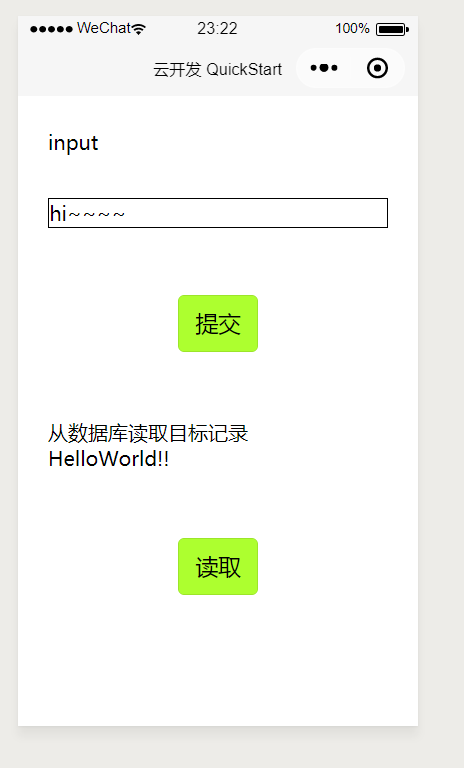
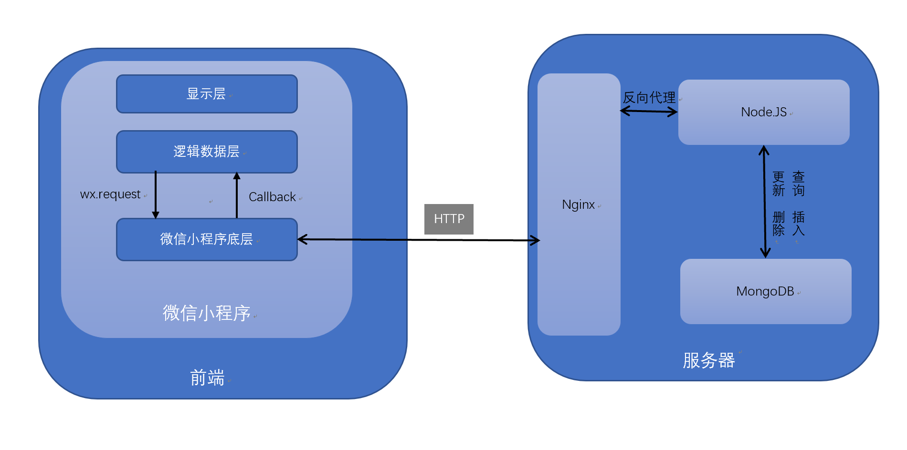

北邮信通导论课进阶实验 - Node JS + Mongodb + 微信小程序开发者接口
===

# 后端的必要性

在[云函数](https://www.oursparkspace.cn/?yada_wiki=1541583107)我们大致了解了业务逻辑的处理并不在手机上进行，所以采用了方便快捷的云函数。但是并不是所有的功能都能够通过云函数实现，所以往往在大多是的生产中，都采用自己搭建服务器作为整个服务的后端。

而且各位应该都已经注册了自己人生中第一个域名以及租赁了人生中第一台服务器，怎么能放着不用呢？通过自己的努力，让他们变得实用起来吧！

没有购买域名或者域名由于没有通过实名认证并不能使用的可以在Freenom注册免费域名（不能备案）进行尝试，没有购买服务器请参考之前的教程租赁学生服务器。

# 目标速览

初始化： 在远程的mongodb上插入一条数据
<!-- TODO: 插入图片 mongo-express 后台图片 -->

有一个表单，里面有一个输入框组件用来输入内容，点击提交按钮以修改云数据库里content字段。还有一个显示区域用于从云数据库读取上面的记录，点击读取按钮成功读取记录后把content字段的值显示在下面。


在输入框里输入新的字符串



点击提交，更新记录成功后清空输入框。再点击读取按钮，把该记录的content字段的值显示在下面。


<!-- PS: TODO: 上面的图片需要更换 -->

# 总体框架



整体请求流程大概是这样的：

1. 用户点击按钮触发事件 @显示层
2. js文件调用wx.request @数据逻辑层
3. 微信小程序底层开始建立TCP连接，发送HTTP报文 @微信小程序底层
4. (可选)后台Nginx(是一个高性能的HTTP和反向代理服务)解析HTTP请求并转发给Nodejs处理 @Nginx
5. Nodejs处理请求，向MongoDB发出对应的操作指令 @NodeJS
6. MongoDB处理请求并返回数据 @MongoDB
7. Nodejs收到请求返回给Nginx @Nodejs
8. (可选)Nginx收到Nodejs回复，发送HTTP回应给请求者 @Nginx
9. 微信小程序底层收到TCP数据并解析HTTP返回数据返回给对应的回调函数 @微信小程序底层
10. 微信小程序js文件的回调函数被调用，更新数据等 @数据逻辑层
11. 界面刷新或者产生提示信息 @显示层

# 搭建服务器的主要功能点

- Nginx： 配置服务器的Nginx 使其能够正确的处理请求
- Nodejs： 能够上传代码到远程服务器并使其能够正确运行
- Mongodb： 在远程运行数据库并顺便使之可以使用简单的web管理界面进行管理

主要难点：

- 远程访问服务器使用命令行，学习如何使用帮助来使用这些命令。
- 修改各种文件中的配置，使之符合客观事实。

# 远程部署

提高内容请看[网络部署](./网络部署.md)

# 本地开发环境

## step1.运行MongoDB

参考之前的教程，保证自己的MongoDB正在运行。

## step2.运行node服务器

进入service目录(这里使用一个cd命令 `cd service` 更多关于cd命令的使用请百度自行学习)，使用

```cmd
npm install
```

安装所需要的依赖。

在启动服务器运行之前运行测试命令，看看你们的设置是否完善。

```cmd
npm test
```

> 看看测试样例，具体的测试样例可以在test文件夹修改。

```cmd
npm run dev
```

看见“server is listening on 8080”没有什么错误就是运行好了。

**PS:** 在真正的使用中NodeJs通常需要把各种不同的功能分割打包，如果你觉得这个分别防止的Nodejs文件不是很好理解可以去`service-pkg`这个文件夹下的app.js就是单文件版的，方便研究各种逻辑。

使用方式和上面完整版的有所不同，使用方式就是“安装依赖`npm install`” 和 “运行 `node app.js`”


# 前端微信小程序

## step1.微信小程序

至此 整个服务端都完成了配置，我们开始折腾微信小程序。

修改 app.js 里面的 urlBase

因为我们已经开启了HTTPS服务，并且配置好了证书，所以我们要使用HTTPS协议进行访问

```JS
urlBase: "https://www.xice.wang"
```

记得改成你自己的域名呀！

如果没有配置https仅仅是在本地跑的服务，注意使用http协议加端口号

**PS:** 关于HTTP和HTTPS的区别欢迎给位去通过百度进行一些自学。

类似于 http://127.0.0.1:8080

然后就可以进行尝试了。

# 反馈

## 石墨文档

可以使用石墨文档进行反馈
[从云开发到nodejs](https://shimo.im/docs/1IB7aZCatlQcsXAK/)

## issue

使用Github自带的[issue](https://github.com/xiaokeji/oursparkspaceNginxNodeConfigStudy/issues)提出问题。