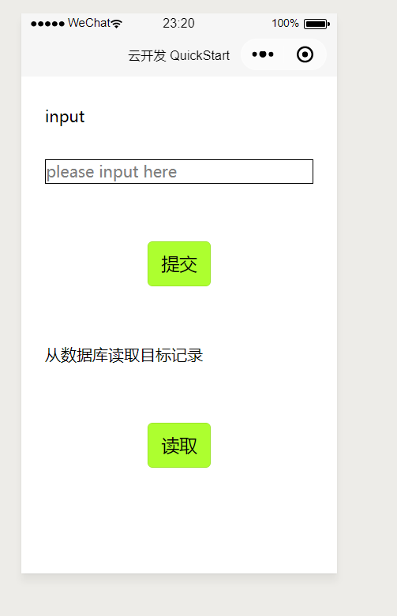
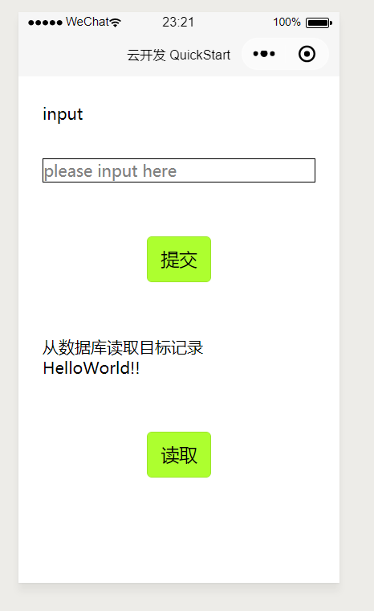
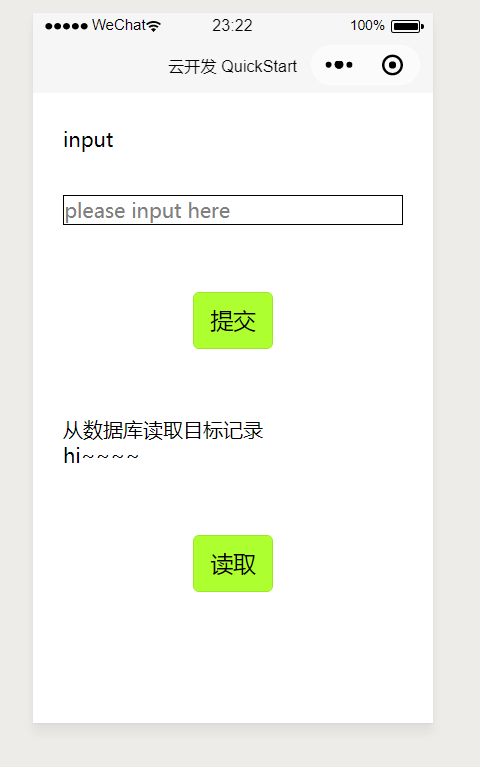

北邮信通导论课进阶实验 - Node JS + Mongodb + 微信小程序开发者接口
===

# 后端的必要性

在[云函数](https://www.oursparkspace.cn/?yada_wiki=1541583107)我们大致了解了业务逻辑的处理并不在手机上进行，所以采用了方便快捷的云函数。但是并不是所有的功能都能够通过云函数实现，所以往往在大多是的生产中，都采用自己搭建服务器作为整个服务的后端。

而且各位应该都已经注册了自己人生中第一个域名以及租赁了人生中第一台服务器，怎么能放着不用呢？通过自己的努力，让他们变得实用起来吧！

没有购买域名或者域名由于没有通过实名认证并不能使用的可以在Freenom注册免费域名（不能备案）进行尝试，没有购买服务器请参考之前的教程租赁学生服务器。

# 目标速览

初始化： 在远程的mongodb上插入一条数据
<!-- TODO: 插入图片 mongo-express 后台图片 -->

有一个表单，里面有一个输入框组件用来输入内容，点击提交按钮以修改云数据库里content字段。还有一个显示区域用于从云数据库读取上面的记录，点击读取按钮成功读取记录后把content字段的值显示在下面。





在输入框里输入新的字符串


点击提交，更新记录成功后清空输入框。再点击读取按钮，把该记录的content字段的值显示在下面。



<!-- PS: TODO: 上面的图片需要更换 -->

# 总体框架


整体请求流程大概是这样的：

1. 用户点击按钮触发事件 @显示层
2. js文件调用wx.request @数据逻辑层
3. 微信小程序底层开始建立TCP连接，发送HTTP报文 @微信小程序底层
4. (可选)后台Nginx(是一个高性能的HTTP和反向代理服务)解析HTTP请求并转发给Nodejs处理 @Nginx
5. Nodejs处理请求，向MongoDB发出对应的操作指令 @NodeJS
6. MongoDB处理请求并返回数据 @MongoDB
7. Nodejs收到请求返回给Nginx @Nodejs
8. (可选)Nginx收到Nodejs回复，发送HTTP回应给请求者 @Nginx
9. 微信小程序底层收到TCP数据并解析HTTP返回数据返回给对应的回调函数 @微信小程序底层
10. 微信小程序js文件的回调函数被调用，更新数据等 @数据逻辑层
11. 界面刷新或者产生提示信息 @显示层

# 搭建服务器的主要功能点

- Nginx： 配置服务器的Nginx 使其能够正确的处理请求
- Nodejs： 能够上传代码到远程服务器并使其能够正确运行
- Mongodb： 在远程运行数据库并顺便使之可以使用简单的web管理界面进行管理

主要难点：

- 远程访问服务器使用命令行，学习如何使用帮助来使用这些命令。
- 修改各种文件中的配置，使之符合客观事实。

# 远程部署

提高内容请看[网络部署](./网络部署.md)

# 本地开发环境

## step1.运行MongoDB

参考之前的教程，保证自己的MongoDB正在运行。

## step2.运行node服务器

为了方便各位的理解，建议先使用单文件`service-pkg`的版本了解真个Js脚本的用途以及包括的部分，但是通常在真正的生产环境中很少将项目的所有代码写在同一个文件中，代码的可维护性基本完全丧失，毕竟通常情况下代码都不是一个人可以写完的，单文件和别人合作的难度可以想象一下突然蹦出几千行代码的绝望。

但是我们可以通过这个文件来学习各个部分的逻辑，然后在将他们分开，这里我们提供了两个版本供各位选择。

### 单文件整合版

首先进入目录`service-pkg`，可以看到两个文件

- `app.js` 主代码程序
- `package.json` npm包依赖描述文件

使用命令`npm install`安装依赖。

> **Tag：** `npm install` 命令只有一个用处就是安装包，在npm看来所有的带`package.json`的文件夹都是一个包，不同的包和包之间是依赖关系，这条命令有两个用法，带参数和不带参数。先说带参数，例如：`npm install mongoose` 就是安装一个mongoose的包，我们在一个空文件夹中运行会看到一些错误信息类似：
>
> 
> 
> 这些警告就是说现在执行npm的位置并不是一个包，因为找不到`package.json`，而且这个是不会自动生成的。如果需要可以使用`npm init`命令初始化一个包。
> 
> 下面我们要说的不带参数的`npm install`其实就是安装当前目录下的包，没有`package.json`的目录下是没有办法直接执行`npm install`的。

安装依赖通常需要一段时间，我们可以对`app.js`进行一下必要信息的填写，使用一个现代文本编辑器打开app.js，在指定的地方填写微信小程序的`appid`和`secretKey`，然后保存。

回过头来我们的依赖应该也已经安装完毕了。这时候我们可以开始运行我们的服务了。

执行`node app.js`运行，没有什么错误的话Nodejs解释器就会一行一行从上到下解释编译运行你的程序，没有任何错误之后会在运行到`app.js`最后一行输出一行打印一行特定的文本。告知你监听的信息。注意这行信息的内容只和最后一行的内容相关(当然包括这个拼接进去的端口号)，跟服务的运行状态没有什么必然联系，修改这行文本也不会对服务的运行造成任何影响，能够输出就意味着上面的所有内容并不存在致命错误，以至于NodeJs不会直接跳出运行进行报错。

看到`app.js`最后一行输出的信息，应该是正常运行了。我们就可以开始微信小程序的部分了。

### 真正的分模块写有部署脚本的NodeJs项目的完全体

相信直接进入这个方式的人已经有部分的Js的基础，就不多废话什么了。

进入service目录(这里使用一个cd命令 `cd service` 更多关于cd命令的使用请百度自行学习)，使用

```cmd
npm install
```

安装所需要的依赖。

> 在启动服务器运行之前运行测试命令，看看你们的设置是否完善。
>
> ```cmd
> npm test
> ```
> 
> 看看测试样例，具体的测试样例可以在test文件夹修改。

运行。

```cmd
npm run dev
```

看见“server is listening on 8080”没有什么错误就是运行好了。

# 前端微信小程序

## step1.微信小程序

至此 整个服务端都完成了配置，我们开始折腾微信小程序。

修改 app.js 里面的 urlBase

```JS
urlBase: "http://127.0.0.1:8080"
```

然后就可以进行尝试了。

# 反馈

## 石墨文档

可以使用石墨文档进行反馈
[从云开发到nodejs](https://shimo.im/docs/1IB7aZCatlQcsXAK/)

## issue

使用Github自带的[issue](https://github.com/xiaokeji/oursparkspaceNginxNodeConfigStudy/issues)提出问题。